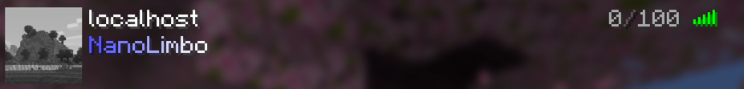
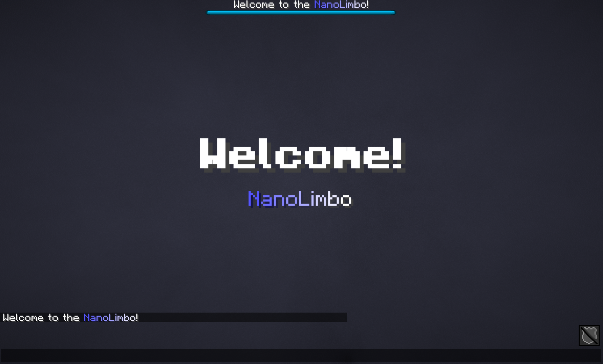
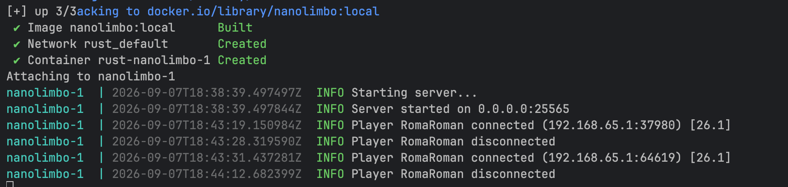

<div align="center">


# NanoLimbo-rs

**A tiny, fast Minecraft limbo server written in Rust.**

Keeps players connected while your real server restarts — 51 protocol versions,
one static binary, a few megabytes of RAM.

[](https://github.com/Astra-Interactive/NanoLimbo-rs/actions)
[](https://github.com/Astra-Interactive/NanoLimbo-rs/releases)
[](https://github.com/Astra-Interactive/NanoLimbo-rs/pkgs/container/nanolimbo-rs)
[](#-supported-versions)
[](https://www.rust-lang.org)
[](LICENSE)

</div>

---

## 🤖 Vibe-coded, not improvised

An LLM typed almost every line. It typed under these rules, written before the first
commit — 6+ years of Java, Kotlin, C, Rust, Go and JS turned into a checklist a model
cannot talk its way out of.

| Rule                            | What it means in this code                                                                      |
|---------------------------------|-------------------------------------------------------------------------------------------------|
| No `unwrap`, `expect`, `panic!` | zero of them in production code, all 9 crates — clippy denies them                              |
| No `unsafe`                     | `unsafe_code = "forbid"`, workspace-wide                                                        |
| Errors are values               | `Result` + a domain error enum per layer, `From` at every boundary                              |
| Network input is hostile        | no indexing, no unchecked length, no overflow; a bad packet closes one connection               |
| Domain owns no I/O              | protocol, text, world, packet hold no socket and no clock — so 51 versions replay in unit tests |
| DI by hand                      | no globals, no locator; the binary is the only place anything is constructed                    |
| Deterministic by design         | ids and time come from injected `IdSource` / `Clock` ports                                      |
| Types, not primitives           | `ProtocolVersion` not `i32`, `Duration` not `u64` ms, named structs not tuples                  |
| One type per file               | explicit imports, dependency-ordered declarations, no `#[allow(dead_code)]`                     |
| Tests state contracts           | `given_when_then`, fakes not mocks, every version-gated branch at `V` and `V - 1`               |
| Trust nothing                   | `rustfmt`, `clippy -D warnings`, 330 tests, byte-for-byte fixtures from the Java build          |

## ✨ Why this one

- 🪶 **Small.** ~4 MB idle in a container, ~57 KB per player. A `scratch` image with nothing in it but the binary.
- 🎮 **51 protocol versions**, 1.7.2 through 26.2 — from one build, no version-specific jars.
- 🔁 **Drop-in.** Reads the Java NanoLimbo `settings.yml` unchanged. Point it at your existing file and it starts.
- 🔀 **All four forwarding modes:** `NONE`, `LEGACY` (BungeeCord), `MODERN` (Velocity), `BUNGEE_GUARD`.
- 🛡️ **No `unsafe` anywhere** — `unsafe_code = "forbid"` workspace-wide, and no panicking path reachable from network input.
- ✅ **330 tests**, including byte-level parity against dumps taken from the Java build.
- 🐳 **Statically linked**, unprivileged, multi-arch (amd64 + arm64) images on GHCR.

No world, no physics, no inventory — that is the point.

## 📸 Preview

<div align="center">
  <br><br>
  <br><br>
  
</div>

## 🚀 Quick start

**Docker** — nothing to build. The shipped default listens on the container's own
loopback, so pick up the container-ready config first:

```sh
curl -o settings.yml https://raw.githubusercontent.com/Astra-Interactive/NanoLimbo-rs/master/docker/settings.yml.example
docker run -d --name nanolimbo -p 25565:25565 \
  -v "$(pwd)/settings.yml:/data/settings.yml:ro" \
  ghcr.io/astra-interactive/nanolimbo-rs:latest
```

**From source** — needs Rust 1.93:

```sh
git clone https://github.com/Astra-Interactive/NanoLimbo-rs && cd NanoLimbo-rs
cargo build --release
./target/release/nanolimbo
```

A `settings.yml` appears in the working directory on first run, carrying the same
defaults as the Java build — it binds **`localhost:65535`**, so set `bind.ip` and
`bind.port` before anyone else can join. `RUST_LOG` overrides the configured `debugLevel`.

## 🎮 Supported versions

|                 |                                                        |
|-----------------|--------------------------------------------------------|
| **Range**       | 1.7.2 (protocol 4) → 26.2 (protocol 776)               |
| **Count**       | 51 versions, all reaching the play phase               |
| **Forwarding**  | `NONE`, `LEGACY`, `MODERN` (Velocity), `BUNGEE_GUARD`  |
| **Config**      | byte-compatible with the Java `settings.yml`           |
| **Verified by** | 330 tests + golden fixtures dumped from the Java build |

## 🖥️ Console commands

| Command           | Does                         |
|-------------------|------------------------------|
| `help`            | Show the command list        |
| `conn`            | Display the connection count |
| `mem`             | Display memory usage         |
| `version` / `ver` | Display the limbo version    |
| `stop`            | Stop the server              |

`Ctrl-C` and `SIGTERM` also stop it cleanly.

## 📊 Against the Java build

300 players logged into both servers, same configuration, both measured at the same
moment from the same place:

```
target       asked  joined      time       idle      loaded   mem/player   join bytes
------------------------------------------------------------------------------------
rust           300     300     0.88s      3.9 MB     20.7 MB      57.3 KB     159.0 KB
java           300     300     0.94s    162.5 MB    201.8 MB     134.1 KB     159.0 KB
```

`join bytes` matching to the byte is the interesting column: both servers put the same
thing on the wire. Out-of-the-box settings on both sides — Java's figure follows its heap
configuration.

<details>
<summary><b>Reproduce it yourself</b></summary>

`limbo-bench` logs a crowd of players into one or more servers and reports what each one
cost. It speaks the protocol through the same version tables the server does, so a new
Minecraft release cannot leave it silently measuring a failed login.

```sh
./bench/compare.sh --players 300                 # this server alone
./bench/compare.sh --protocol 47                 # join as 1.8 instead
./bench/compare.sh --jar path/to/NanoLimbo.jar   # against the original
```

Upstream lives in its own repository, so its jar is pointed at rather than assumed:

```sh
git clone https://github.com/Nan1t/NanoLimbo && (cd NanoLimbo && ./gradlew shadowJar)
```

To measure a container rather than a process, name it after the `@` instead of a pid:

```sh
docker compose up -d
cargo run --release --bin limbo-bench -- --players 300 \
  server=127.0.0.1:25565@$(docker compose ps --format '{{.Name}}' | head -1)
```

It can also be pointed at anything already running. The `@pid` is optional — without it
the server is still load-tested, only its memory goes unreported:

```sh
cargo run --release --bin limbo-bench -- --players 500 rust=127.0.0.1:25565@$(pgrep nanolimbo)
```

**Measure on the platform you deploy to.** The figures above are containers. Natively on
macOS the same server reports 22.7 MB idle instead of 3.9 — almost all of it platform
overhead rather than anything the server allocates. Below a couple of hundred players the
per-player column is mostly startup cost spread thin, and the tool says so.

</details>

## 🐳 Containers

```sh
docker compose up --build          # build locally
docker pull ghcr.io/astra-interactive/nanolimbo-rs:latest
```

A statically linked binary on `scratch`: nothing to patch, no shell to exec into. Runs
unprivileged as uid 65532 and reads its configuration from `/data`.

<details>
<summary><b>Supplying your own configuration</b></summary>

`docker/settings.yml.example` is the shipped configuration with the two changes a
container needs — an empty `bind.ip` so it listens on every interface rather than on its
own loopback, and the conventional port.

Compose mounts it read-only, so you edit it on the host. Remove the mount and the server
writes its own default into the volume — `localhost:65535`, which nothing outside the
container can reach.

```sh
docker run -d -p 25565:25565 \
  -v "$(pwd)/docker/settings.yml.example:/data/settings.yml:ro" \
  ghcr.io/astra-interactive/nanolimbo-rs:latest
```

</details>

## 🧱 Project layout

<details>
<summary><b>Crates in the workspace</b></summary>

```
crates/
  limbo-protocol   versions, connection states, packet id tables, buffer primitives
  limbo-text       chat components, MiniMessage, per-version JSON and NBT encoding
  limbo-world      dimension codecs and registry tags, embedded in the binary
  limbo-packet     clientbound packets and their per-version pre-encoding
  limbo-net        framing, traffic limits, identity, proxy forwarding
  limbo-config     settings.yml
  limbo-server     connection lifecycle and decision making, with no I/O
  limbo-bench      load generator and the side-by-side comparison
  nanolimbo        the binary: composition root and async runtime
fixtures/          reference data the port is verified against
```

Everything except `nanolimbo` and `limbo-bench` holds no sockets and no clock, so the
whole login sequence is replayed for all 51 versions in unit tests that run in
milliseconds.

</details>

## 🔀 Differences from the Java implementation

<details>
<summary><b>Fixed, hardened, and not carried over</b></summary>

Each difference is deliberate and documented where it is implemented.

**Fixed**

- The clientbound disconnect id on 1.20.3 / 1.20.4.
- The serverbound configuration plugin message id from 1.20.2.
- Text silently dropped from components on 1.20.3+.
- Connection registry keying that lost track of two players sharing a name.

**Hardened**

- No path reachable from network input can panic.
- BungeeGuard tokens are compared in constant time.
- The traffic limiter cannot overflow into disabling itself.

**Not carried over**

- `netty.transportType: IO_URING` and `netty.threads.bossGroup` have no equivalent under
  this runtime. Both are accepted and reported as warnings rather than ignored or rejected.
- `mem` reports the operating system's resident figure instead of JVM heap statistics, and
  says so plainly where the platform cannot tell.

</details>

## 🤝 Contributing

Issues and pull requests are welcome at
[Astra-Interactive/NanoLimbo-rs](https://github.com/Astra-Interactive/NanoLimbo-rs).

CI runs `rustfmt`, `clippy -D warnings`, the tests, a `Cargo.lock` check and a Docker
build on every pull request. Run this before opening one:

```sh
cargo fmt --all && cargo clippy --workspace --all-targets -- -D warnings && cargo test --workspace
```

The wire format is the contract — one wrong byte disconnects a client. Parity is checked
against the golden fixtures in `fixtures/`, which are generated, not hand-edited.

## 💖 Support the project

<table>
<tr>
<td align="center" width="130">
<br/>
<sub><b>Telegram</b></sub>
</td>
<td align="center">
<a href="https://t.me/makeevrserg">

</a>
</td>
</tr>
<tr>
<td align="center" width="130">
<br/>
<sub><b>Boosty</b></sub>
</td>
<td align="center">
<a href="https://boosty.to/empireprojekt/donate">

</a>
</td>
</tr>
<tr>
<td align="center" width="130">
<br/>
<sub><b>USDT</b></sub><br/>
<sub>Polygon (POL)</sub>
</td>
<td>

```text
0x3955abc6f5396e57b11a05b96f988bc60708c9b0
```

</td>
</tr>
<tr>
<td align="center" width="130">
<br/>
<sub><b>USDT</b></sub><br/>
<sub>TRC20</sub>
</td>
<td>

```text
TLYf28vZeuuHcEJMHSZtuYEzQ2DjNvNE3W
```

</td>
</tr>
<tr>
<td align="center" width="130">
<br/>
<sub><b>USDT</b></sub><br/>
<sub>Solana</sub>
</td>
<td>

```text
6sYK6Nss8cjLeeTp6u3t63JG4f1hFf8sDQ7nVtMNoyps
```

</td>
</tr>
<tr>
<td align="center" width="130">
<br/>
<sub><b>TON</b></sub><br/>
<sub>TON network</sub>
</td>
<td>

```text
UQDfywxsnHI1ko_uqBYKED3RoMzoVm3mnxuS_-JVQc4mSSJt
```

</td>
</tr>
</table>

A ⭐ on the repository costs nothing and helps just as much.

## 📜 Licence & credits

Licensed under **GPL-3.0-or-later**, as the original — see [`LICENSE`](LICENSE).

This is a **derivative work** of [**Nan1t/NanoLimbo**](https://github.com/Nan1t/NanoLimbo)
by **Nan1t** and its contributors. It was ported rather than rewritten from scratch, the
Java implementation remains the behavioural reference this port is verified against, and
the licence follows accordingly. Go star the original.

Ported and maintained by [**makeevrserg**](https://github.com/makeevrserg) (Roman Makeev)
under [Astra-Interactive](https://github.com/Astra-Interactive).
